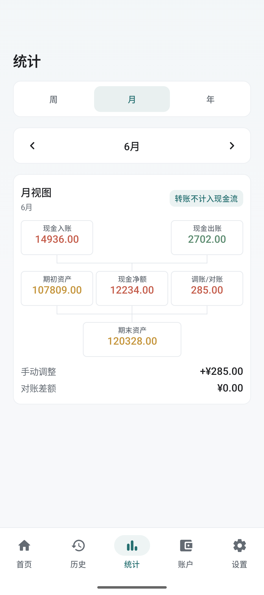

# Money

一个离线优先的 Android 个人记账应用，基于 **Kotlin + Jetpack Compose** 实现。

仓库地址: [https://github.com/shihuaidexianyu/piggy-bank](https://github.com/shihuaidexianyu/piggy-bank)

## ✨ 功能特性

- 多账户管理：活动账户可自定义排序，归档账户只读保留历史。
- 现金流记录：记录收入与支出，并支持用途标签。
- 账户间转账：支持从任意账户转入/转出。
- 对账调整：对账作为普通记账事件入账，按固定差额影响余额。
- 期初资产：账户新建的初始余额作为开户时的期初资产处理。
- 调整记录：支持手动修正余额（独立于自动计算）。
- 提醒：支持月度、年度、间隔天数等周期的到期提醒，仅应用内展示。
- 历史与搜索：按账户、日期范围、金额和关键字过滤。
- 深色模式：支持浅色/深色主题。
- JSON 导出：设置页可导出完整数据，方便迁移与备份。
- 隐私优先：应用仅本地离线存储，不依赖网络服务。

## 📱 界面截图

以下截图使用调试构建自动生成的随机演示数据。

<table>
  <tr>
    <td align="center"><br />首页</td>
    <td align="center"><br />历史</td>
  </tr>
  <tr>
    <td align="center"><br />统计</td>
    <td align="center"><br />账户</td>
  </tr>
  <tr>
    <td align="center"><br />设置</td>
    <td align="center"><br />提醒中心</td>
  </tr>
  <tr>
    <td align="center"><br />账户详情</td>
    <td align="center"><br />新建账户</td>
  </tr>
  <tr>
    <td align="center"><br />记录出账</td>
    <td align="center"><br />记录转账</td>
  </tr>
  <tr>
    <td align="center"><br />核对余额</td>
    <td align="center"><br />新建提醒</td>
  </tr>
</table>

## 🧱 技术栈

- **语言**: Kotlin 2.2.20
- **UI**: Jetpack Compose BOM 2025.10.01 + Material 3
- **架构**: Clean Architecture（Domain / Data / UI）+ MVVM
- **数据库**: Room 2.8.0（SQLite），模式版本 10
- **状态存储**: DataStore Preferences 1.1.7
- **导航**: Navigation Compose 2.9.5
- **依赖注入**: 手动注入（`MoneyAppContainer`）
- **SDK 版本**: minSdk 31，targetSdk/compileSdk 36
- **包名**: `com.shihuaidexianyu.money`

## 🚀 构建与测试

```bash
# 调试构建
./gradlew assembleDebug

# 发布构建
./gradlew assembleRelease

# 运行全部单元测试
./gradlew test

# 运行 Lint
./gradlew lint
```

也可使用发布脚本进行版本号自动递增与打包：

```bash
# 仅打包并自动 bump 版本
.\scripts\build-release.ps1

# 先测试再打包、提交、推送
.\scripts\build-release.ps1 -RunTests -Commit -Push
```

## 🗂️ 目录结构

```
app/src/main/java/com/shihuaidexianyu/money/
├── domain/          # 业务模型与接口、UseCase
├── data/            # Room 实体、DAO、仓库实现
├── ui/              # Compose 页面与各 feature ViewModel
├── navigation/      # 导航与 ViewModel 工厂
└── util/            # 工具方法与格式化逻辑
```

## 📄 协议

All rights reserved.
