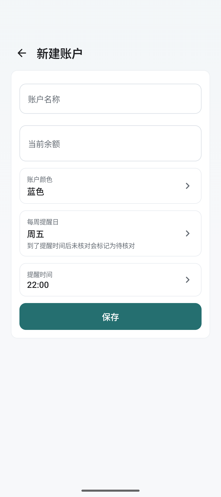
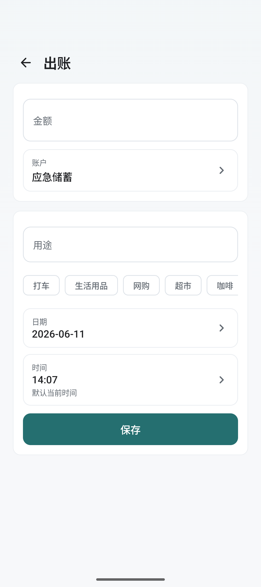

<p align="center">
  
</p>

<h1 align="center">Money</h1>

<p align="center">
  一个完全离线、基于 Kotlin 与 Jetpack Compose 的 Android 个人记账应用。
</p>

<p align="center">
  当前版本 <code>2.5.33</code>（versionCode <code>142</code>）
</p>

## ✨ 功能特性

- 多账户管理：排序、隐藏、关闭和重新开启；区分日常与投资账户。
- 现金流与转账：记录收入、支出和账户间转账，金额始终以最小货币单位精确存储。
- 余额管理：支持对账更新和手工调整；历史对账差额保持为固定账本事件。
- 投资损益：投资账户的对账差额在读取时解释为投资收益或亏损，不改变账本算术。
- 周期提醒：支持月度、年度和自定义天数周期，并通过 WorkManager 投递后台通知。
- 历史与搜索：按账户、记录类型、日期、金额、关键字及业务含义筛选。
- 隐私与安全：支持生物识别应用锁、通知金额隐藏和最近任务内容保护。
- JSON 备份：明文 backup v5，兼容 v1-v4，导入前生成安全快照并支持条件回滚。
- 外部入口：桌面快捷方式和通知深链统一进入应用启动队列。
- 局域网 AI：用户主动启动临时 LAN 服务，通过一次性配对码、会话 token 和 AI Journal 提供可撤销的 MCP 账本访问。

## 📱 界面截图

以下截图使用调试构建自动生成的随机演示数据。

<!-- markdownlint-disable MD033 -->

<table>
  <tr>
    <td align="center"><br />首页</td>
    <td align="center"><br />历史</td>
  </tr>
  <tr>
    <td align="center"><br />账户</td>
  </tr>
  <tr>
    <td align="center"><br />设置</td>
    <td align="center"><br />提醒中心</td>
  </tr>
  <tr>
    <td align="center"><br />账户详情</td>
    <td align="center"><br />新建账户</td>
  </tr>
  <tr>
    <td align="center"><br />记录出账</td>
    <td align="center"><br />记录转账</td>
  </tr>
  <tr>
    <td align="center"><br />核对余额</td>
    <td align="center"><br />新建提醒</td>
  </tr>
</table>

<!-- markdownlint-enable MD033 -->

## 🤖 Money Client Skill

[Money Client Skill](https://github.com/shihuaidexianyu/money-client-skill) 是本项目的独立 Codex skill 与 Python MCP bridge。它支持配对、账户与流水查询、带真实备注的统计、现金收支/转账写入、AI Journal 和冲突感知撤销。

- 仓库：[shihuaidexianyu/money-client-skill](https://github.com/shihuaidexianyu/money-client-skill)
- 安装包：[v0.1.0 Release](https://github.com/shihuaidexianyu/money-client-skill/releases/tag/v0.1.0)
- 调用示例：`$money-client 查询近一个月的日常收支，并按备注解释主要变化`

手机端服务仅供可信局域网使用，默认最长运行四小时；停止服务会立即使会话 token 失效。AI 写入必须由当前请求明确授权，并与 Journal 记录在同一 Room 事务中完成。

## 🧱 技术栈

- **语言**: Kotlin 2.2.20
- **UI**: Jetpack Compose BOM 2025.10.01 + Material 3
- **架构**: Clean Architecture（Domain / Data / UI）+ MVVM
- **数据库**: Room 2.8.0（SQLite），模式版本 19
- **设置存储**: Room portable settings + DataStore Preferences 1.1.7 device preferences
- **导航**: Navigation Compose 2.9.5
- **后台任务**: WorkManager 2.10.1
- **本地 AI bridge**: 临时 LAN TCP 服务 + Python MCP stdio
- **依赖注入**: 手动注入（`MoneyAppContainer`）
- **构建工具**: AGP 9.1.0 + Java 17
- **SDK 版本**: minSdk 31，targetSdk/compileSdk 36
- **包名**: `com.shihuaidexianyu.money`

## 🚀 构建与测试

```bash
# 调试构建
./gradlew assembleDebug

# 发布构建
./gradlew assembleRelease

# 运行全部单元测试
./gradlew test

# 运行 Debug Lint
./gradlew lintDebug
```

也可使用发布脚本进行版本号管理、测试、签名校验与打包：

```bash
# 仅打包并自动 bump 版本
.\scripts\build-release.ps1

# 先测试再打包、提交、推送
.\scripts\build-release.ps1 -RunTests -Commit -Push
```

发布包必须使用本地 `signing/keystore.properties` 配置的正式证书签名。备份文件是未加密 JSON，请只保存到可信位置。

## 📌 当前发布范围

`2.5.33` 加入用户主动启动的局域网 AI 服务、Python MCP bridge 和设备本地 AI Mutation Journal。AI 对现金收支及转账的新增、修改和删除会与 Journal 原子提交；严格全局 LIFO 撤销会在记录后来被修改时拒绝覆盖。协议当前为可信局域网明文传输，不提供云端访问。

## 🗂️ 目录结构

```text
app/src/main/java/com/shihuaidexianyu/money/
├── domain/          # 业务模型与接口、UseCase
├── data/            # Room 实体、DAO、仓库实现
├── ui/              # Compose 页面与各 feature ViewModel
├── navigation/      # 导航与 ViewModel 工厂
├── notification/    # WorkManager 通知投影与调度
├── lan/             # 临时局域网服务、协议、配对与请求路由
└── util/            # 工具方法与格式化逻辑
```

## 📄 协议

All rights reserved.
